<!-- The hero images are generated by dfwb-research/.github (repos/deepfake-workbench/); copy them from there, never edit them here. -->

<picture>
  <source media="(prefers-color-scheme: dark)" srcset="docs/assets/hero-dark.svg">
  
</picture>

A uniform, plugin-driven workbench for deepfake detection research: raw dataset → verified
inventory → face clips → trained detector → score file → evaluation report, with every stage
pluggable and every result traceable to a protocol version, a processing profile and a config
fingerprint.

> **Status:** pre-release (`0.1.0b2`). Nothing is released on PyPI yet; install from a clone.
> Linux is the only supported and tested OS. Python ≥ 3.12.

## Run from a clone

```bash
git clone https://github.com/dfwb-research/deepfake-workbench && cd deepfake-workbench
uv sync
uv run dfwb doctor
```

## Quickstart

dfwb ships a synthetic dataset, toyfake, generated entirely from a seed, so the whole
raw-dataset → inventory → protocol → training pipeline can be tried with nothing to download:

```bash
export DFWB_DATASETS_ROOT=~/datasets
export DFWB_WORK_ROOT=~/dfwb-work

uv run dfwb datasets synth toyfake --out "$DFWB_DATASETS_ROOT"
uv run dfwb inventory build toyfake
uv run dfwb protocols verify toyfake

uv run dfwb preprocess run toyfake --profile toy-64-center-8f
uv run dfwb preprocess status toyfake --profile toy-64-center-8f

cat > toy-cpu.yaml <<'YAML'
schema: dfwb.train/1
extends: [dfwb://templates/toy-cpu.yaml]
YAML
uv run --extra train dfwb train -c toy-cpu.yaml --device cpu

uv run dfwb runs list
uv run dfwb runs show toy-cpu
```

`datasets synth` writes a small set of synthetic real and blended-fake videos to
`$DFWB_DATASETS_ROOT/toyfake`. `inventory build` scans that folder and writes
`$DFWB_WORK_ROOT/toyfake/inventory.jsonl`. `protocols verify` joins that inventory against dfwb's
built-in toyfake protocol pack and writes a coverage report; with the defaults above it reports
full coverage. `preprocess run` crops and tracks a face through every video with the
`toy-64-center-8f` profile, which has no detector and no model to download (like every profile, it
needs the `preprocess` extra, which a clone's `uv sync` already installs), writing a lossless frame
store under `$DFWB_WORK_ROOT/toyfake/processed/`; `preprocess status` then counts it by outcome.
`train` needs the `train` extra (PyTorch, Lightning, timm) — `uv run --extra train` installs the
CPU build for this one invocation; `docs/install.md` covers installing a GPU build instead. The
`toy-cpu.yaml` file just extends the shipped `toy-cpu` template, which trains a tiny CNN on the
toyfake tree just built, for two epochs, writing its run under `./runs/toy-cpu/`; `runs list` shows
it, and `runs show` its full detail: data sources, validation metrics, and the config fingerprint
that identifies the experiment.

From here, score the trained run and turn its scores into metrics with confidence intervals:

```bash
uv run dfwb score --detector "run:runs/toy-cpu/latest#best" --protocol toyfake/official --split test
uv run dfwb eval runs/scores/tiny-cnn-mean-linear/toyfake-official/*.scores.csv
```

See `docs/concepts/protocols.md` for what `verify` checks and its exit codes,
`docs/concepts/processing-profiles.md` for the shipped face-processing profiles and the processed
store's layout, `docs/concepts/training.md` for what the training keys do,
`docs/concepts/detectors.md` for the detector contract a trained run implements and how to load
one back, `docs/concepts/score-files.md` for the C5 score file `dfwb score` writes,
`docs/guides/cross-dataset-eval.md` for scoring a suite and comparing detectors,
`docs/install.md` for installing the face-detection backends and a PyTorch build, and
`docs/guides/add-a-dataset.md` / `docs/guides/write-a-plugin.md` for wiring up a real dataset or a
model component of your own.

### I only have score files from my own code

No training or preprocessing needed: `dfwb eval import` turns a CSV your own code already
produced into a C5 score file against any registered protocol split, filling in every video the
file lacks as a `missing` row rather than silently narrowing the split, and `dfwb eval` then
reports coverage-aware metrics with confidence intervals — all without installing `torch` at all.

```bash
cat > my_scores.csv <<'CSV'
video_id,prob
REAL/p006,0.10
REAL/p009,0.22
REAL/p015,0.05
BLEND_A/p006_p058,0.81
BLEND_A/p009_p011,0.74
BLEND_A/p015_p013,0.63
CSV

uv run dfwb eval import my_scores.csv --protocol toyfake/official --split test \
  --map key=video_id,score=prob --polarity fake-high --out imported

uv run dfwb eval imported/toyfake-official-test.scores.csv --bootstrap 500
```

The six videos above are matched by key; the other 35 videos of the split's test set become
`missing` rows, and the printed coverage (`{'expected': 41, 'ok': 6, 'missing': 35, 'error': 0}`)
says so plainly rather than pretending the file covers more than it does.

### I want to add a detector

Any Python callable that returns a C4 `Detector` can be scored, with no training and no adapter
card, through the `py:<module>:<factory>` detector source:

```python
# my_detector.py
from __future__ import annotations

import torch

from dfwb.core.detector import DetectorMeta, DetectorOutput, InputSpec

_SPEC = InputSpec(crop="full-frame", crop_scale=None, size=(64, 64), frames=8)


class BrightnessDetector:
    """P(fake) = the clip's own mean pixel brightness -- a toy, not a real detector."""

    def __init__(self) -> None:
        self.meta = DetectorMeta(
            name="brightness",
            version="0.1",
            contract_version=(1, 0),
            input=_SPEC,
            license="MIT",
            weights_license=None,
            citation=None,
            source="py:my_detector:make_detector",
        )

    def to(self, device: torch.device) -> "BrightnessDetector":
        return self

    def predict(self, batch) -> DetectorOutput:
        score = batch.clips.mean(dim=tuple(range(1, batch.clips.ndim))).clamp(0.0, 1.0)
        return DetectorOutput(score=score)


def make_detector() -> BrightnessDetector:
    return BrightnessDetector()
```

```bash
PYTHONPATH=. uv run dfwb score --detector py:my_detector:make_detector \
  --protocol toyfake/official --split test --profile toy-64-center-8f
```

`<module>` must be importable on the interpreter's own path — `PYTHONPATH=.` puts the current
directory on it, so `my_detector.py` next to it resolves; installed code needs no such override.

See `docs/guides/add-a-detector.md` for the full guide, including how to package a detector as a
shareable, licence-aware zoo adapter card instead of a one-off factory function; the framework's
zoo ships only two sanity-check dummies (`zoo:chance`, `zoo:random`) in this release, no real
third-party adapters.

## Data policy

DFWB never distributes media. Users obtain datasets from their owners; DFWB works with identifiers,
labels and splits only.

## Data in several places, several machines

Datasets are often spread across more than one storage location, and that layout usually differs
from machine to machine. `DFWB_DATASETS_ROOT` accepts a `:`-separated list of roots, searched in
order; `dfwb doctor` lists every root it searched and where each dataset was found.

Per-machine settings belong in a `.env` file next to where you run `dfwb` (copy `.env.example`
and edit it; `.env` is git-ignored and never committed). `dfwb` loads it explicitly, before any
subcommand runs, never at import; a value already set in the real environment always wins:

```bash
# .env
DFWB_DATASETS_ROOT=/data/datasets:/nfs/datasets
DFWB_WORK_ROOT=/data/dfwb-work
```

`--env-file PATH` loads a specific file instead, and `--no-env-file` skips loading one entirely.

For settings that should be checked in (shared defaults plus per-host overrides), use
`dfwb.toml`'s `[hosts.<name>]` tables, keyed by short hostname (or `DFWB_HOST`):

```toml
# dfwb.toml
[roots]
datasets = "/shared/datasets"

[hosts.gpu-node-1.roots]
datasets = ["/fast/datasets", "/nfs/datasets"]

[hosts.gpu-node-1.datasets]
kodf = "/fast/KoDF-mirror"
```

## Licence

MIT. See [`LICENSE`](LICENSE).

## Principles

**Never media.** DFWB works with identifiers, labels and splits only; every dataset still comes
from its own owner, under the owner's terms.

**Reproducible and traceable.** Every result carries a protocol version, a processing profile and
a config fingerprint, so a score file or a trained run can always be traced back to exactly what
produced it — and, wherever a detector has one, its own training seed.

**Progressive installs.** The base install pulls no `torch` at all: browsing protocols, building
inventories and evaluating score files all work from it. Extras (`preprocess`, `train`, `zoo`) add
exactly the heavier dependencies each stage needs, never more.

## Cite this work

If DFWB helps your work, please consider citing it (see [`CITATION.cff`](CITATION.cff)); GitHub's
"Cite this repository" button gives you the reference once this repository is public.

## Maintainer

[Luke Collins](https://github.com/lukegcollins), Deakin University
([ORCID 0009-0002-7771-1081](https://orcid.org/0009-0002-7771-1081)).

Contributions are welcome; see the organisation's
[contributing guidelines](https://github.com/dfwb-research/.github/blob/main/CONTRIBUTING.md).

## Acknowledgments

This work was supported by a [DUPR Scholarship](https://www.deakin.edu.au) and partially
funded by [Dynamis Group](https://dynamisgroup.com.au). We also gratefully acknowledge the
authors and contributors of the associated modules, packages, datasets, and detectors
utilised in this research; we make no claims of ownership regarding these external resources.
